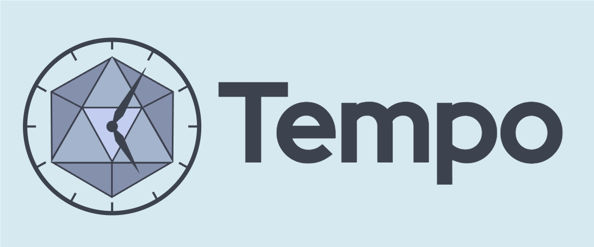

# Tempo: Compiled Dynamic Deep Learning with Symbolic Dependence Graphs



# SOSP'25 Reproducibility

See [repro/README.me](repro/README.md)

## Installation
If intending to develop, use the installation guide in [CONTRIBUTING.md](CONTRIBUTING.md)

Minimum python version is 3.10.

```bash
git clone https://github.com/LSDS/Tempo
cd Tempo

python3.10 -m venv ./venv
source ./venv/bin/activate

#NOTE: First, install backends seperately

#For CPU support use this:
pip3 install torch torchvision torchaudio --index-url https://download.pytorch.org/whl/cpu

#For GPU support use this or cu121, depending on your driver version.
pip3 install torch torchvision torchaudio --index-url https://download.pytorch.org/whl/cu118

# To use the XLA backend, JAX is required
# JAX for CPU
pip install -U "jax[cpu]"

#JAX for GPU.
pip install -U "jax[cuda12_pip]" -f https://storage.googleapis.com/jax-releases/jax_cuda_releases.html

# INSTALL with extras (also [examples, dev])
pip install -e ".[llm, rl]"

# If extras are not wanted:
# Base installation
pip install -e .
```
