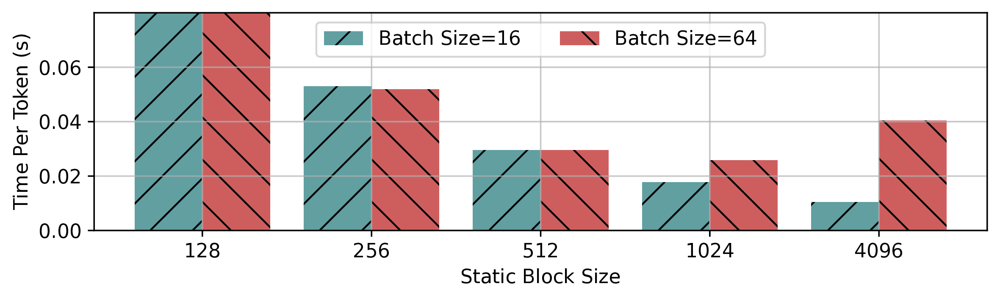

# Tempo - SOSP'25 Reproducibility

* **Paper Title:** Tempo: Compiled Dynamic Deep Learning with Symbolic Dependence Graphs
* **Paper ID:** #378


Welcome, we have made a good-faith effort to reproduce all of our original results in a (hopefully) simple to use package.

## Hardware/Software Used

All experiments use the same hardware and software configuration.
We use a server with an AMD EPYC 7402P 24-core
CPU, 384 GB of DDR4 RAM (3200 MT/s) at least one NVIDIA
RTX A6000 GPU (48 GB of GDDR6 RAM, PCIe Gen4 ×16
at 32 GB/s). We run Ubuntu v22.04 with Linux kernel v5.15.

Our particular host has 4 A6000 GPUs, and our scripts are prepared to parallelize
experiments across available GPUs.

We use Python 3.10.
Originally, we used CUDA v12.1, PyTorch v2.5.1, and JAX v0.4.35, but have since reproduced
the results using some updated dependencies:
* CUDA v12.1 -> v12.8
* PyTorch v2.5.1 -> v2.7.1
* JAX v0.4.35 -> v0.6.2

The full locked list of dependencies file can be seen in [here](../requirements/requirements-repro.txt).

We have packaged the experiments into an easy to use docker container.
Thus, to reproduce these results, you will need access to a similar host with
docker installed (with nvidia container runtime).

Upon request, we can provide SSH access to the host on which results were gathered.

## Artifact Description

### Top-Level Project Structure

Relevant modules in Tempo relating to the claims in the paper:
```text
tempo                                               # source directory
├── api                                             # user-interface (Section 3)
├── core                                            # index expressions, tensor ops (Section 4)
├── runtime                                         # execution runtime (Section 6)
└── transformations                                 # sdg transformations (Section 4&5)
```

### Reproducibility Module Structure

We've packaged the reproducibility process into two shell scripts which should automate the
entire process. Despite this, we describe the structure of the module (shared utilities omitted).

```text
docker
└── gpu.dockerfile                           # Docker file to use in reproducibility efforts

repro                                        # Package containing all reproducibility code
├── build_run_container.sh                   # Script to build above container
├── run_all_exprs_and_plot.sh                # Runs all experiments and plots all results
│  
├── expected_results/                        # PNG examples of the expected plots and speedup analysis
│  
├── sec7_2_lm_decode/                        # Scripts for running and plotting Section 7.2's experiments
│   │  
│   ├── impls/                               # Implementations of GPT2's architecture in JAX/Torch/Tempo
│   ├── plot/                                # Plotting scripts for Section 7.2
│   │   ├── plot_gpt2_time_per_token.py      # Script to plot Figure 9 and 10
│   │   ├── plot_block_size.py               # Script to plot Figure 11
│   │   └── plot_mem_usage.py                # Script to plot Figure 12
│   │
│   ├── run_measure_tpt.py                   # Runner for time-per-token experiments (Figures 9-10)
│   ├── run_block_size_microbenchmark.py     # Runner for experiment of Figure 11
│   ├── run_mem_usage.py                     # Runner for memory usage experiments (Figure 12)
│   │
├── sec7_3_rl_train/                         # Scripts for running and plotting Section 7.3's experiments
│   │
│   ├── impls/                               # Implementations of PPO in Tempo & baselines
│   ├── plot/                                # Plotting scripts for Section 7.3
│   │   │  
│   │   ├── plot_small_to_med_scale.py       # Script to plot Figure 13
│   │   ├── plot_large_obs.py                # Script to plot Figure 14
│   │   └── speedup_analysis.py              # Additional analysis scripts for aggregate values
│   │
│   ├── run_large_obs.py                     # Runner for large observation experiments (Figure 14)
│   └── run_small_to_med_scale.py            # Runner for small-to-medium scale experiments (Figure 13)
│  
└── sec7_4_algo_specific_sched/              # Scripts for running and plotting Section 7.4's experiments
    ├── impls/                               # Algorithm-specific scheduling implementations
    ├── plot/
    │   └── plot_algo_specific_sched.py      # Script to plot Figure 15
    │
    └── run_algo_specific_sched.py           # Runner for algorithm-specific scheduling experiments (Figure 15)
```

The experiment runners store the input and configuration used in experiments in top-level constants.
By default, runners produce results in ./results, which the plotting scripts read from by default.
All scripts should offer usage help with --help.


## Resources and Time Taken

End-to-end, the experiments take roughly 10 hours to complete, with few minutes of active time.
Most experiments will fully utilize the available GPUs, without CPU pressure.
However, run_large_obs.py and run_algo_specific_sched.py will also consume up to 200GB
of CPU memory due to the swapping involved.

Breakdown:
* run_block_size_microbenchmark.py: ~15 minutes
* run_measure_tpt.py: ~1 hour
* run_mem_usage.py: ~3 hours
* run_small_to_med_scale.py: ~1.5 hours
* run_large_obs.py: ~2 hours
* run_algo_specific_sched.py: ~1 hour

## Minimal Working Example

For this, you can refer to [repro/sec7_3_rl_train/impls/tempo_ppo.py](../repro/sec7_3_rl_train/impls/tempo_ppo.py).
Which can be executed as follows:

```bash

git clone https://github.com/lsds/Tempo/ tempo
cd tempo
chmod +x repro/build_run_container.sh

./repro/build_run_container.sh

# Now in container
python repro/sec7_3_rl_train/impls/tempo_ppo.py

```

## Running All Experiments

We have aimed to make this process as simple as possible:

```bash

git clone https://github.com/lsds/Tempo/ tempo
cd tempo
chmod +x repro/build_run_container.sh

./repro/build_run_container.sh

# Now in container
chmod +x repro/run_all_exprs_and_plot.sh
./repro/run_all_exprs_and_plot.sh

# Before exiting the container, in another shell, copy results out of container
docker cp tempo-repro:/home/tempo/tempo/results ./results
docker cp tempo-repro:/home/tempo/tempo/plots ./plots

# If running in our server infrastructure, you can then scp the results to your local machine
ssh -4 <HOST> "tar -c -C /home/<USER> /path/to/results | xz -c" | xz -d | tar -x
ssh -4 <HOST> "tar -c -C /home/<USER> /path/to/plots | xz -c" | xz -d | tar -x

```

## Working with LaunchLib

We developed a tiny library for parallelizing experiments across gpus.

Individual "run*.py" experiment files support passing '--gpus "0,1,2,3"' to assign gpus and
'--phbgpu 1' to indicate the GPU with best latency to CPU memory. However, note that
"run_all_exprs_and_plot.sh" should auto-detect this.

If you find that some experimental result was compromised (e.g. by another user starting a workload),
or that an experiment fails and you wish to retry it, it is sufficient to delete the results
subdirectory relating to the failed results. For example, if the GPT-2 block-size microbenchmark experiment is
compromised (for batch size=16 and statify block size=1024) and , you can simply remove ./results/gpt2_decode/block_size_microbenchmark/bs16_block1024/ and rerun the experiment. Our scripts
will skip any experiments for which directories already exist.

## Notes


### RLlib at large scale

The RLlib baseline, in the large observation experiment, can consume all host memory,
causing the machine to fail and require physical restart.
For this reason, we have chosen to skip RLlib for this experiment by default.
However, it can be enabled by passing only --skip_sys "cleanrlcache" to run_large_obs.py.

### Manual alignment

The plot in Figure 15a requires manual alignment to reproduce similar presentation to that in the paper.
It is unlikely that the provided default values will reproduce the original image exactly.
However, the shading parameters are at the top-level of plot_algo_specific_sched.py and can be
tweaked if desired.

## Warning Messages to expect

The following can be ignored:

```bash
Gym has been unmaintained since 2022 and does not support NumPy 2.0 amongst other critical functionality.
Please upgrade to Gymnasium, the maintained drop-in replacement of Gym, or contact the authors of your software and request that they upgrade.
Users of this version of Gym should be able to simply replace 'import gym' with 'import gymnasium as gym' in the vast majority of cases.
See the migration guide at https://gymnasium.farama.org/introduction/migration_guide/ for additional information.
2025-08-01,21:19:13,685 WARNING  [163403,jumanji_envs.py:47]: Jumanji module not found: No module named 'jumanji'. Likely not installed.
2025-08-01,21:19:13,687 WARNING  [163403,cule_envs.py:79]: CULE module not found: No module named 'torchcule'. Likely not installed.
```

The first is caused by our experiments being forced to use an outdated gym version so every baseline
is functional.
The two warnings are Tempo recognizing that certain RL environments are not available.

## Errors to expect

The following experiment/configurations are expected to fail:

```bash
tempo@1f9fa1849d84:~/tempo/results$ find | grep error.txt
./gpt2_decode/tpt/jax_seq8192_attncausal_win0_bs64/error.txt
./gpt2_decode/tpt/torchnaive_seq16384_attnwindow_win512_bs64/error.txt
./gpt2_decode/tpt/jax_seq16384_attnwindow_win512_bs64/error.txt
./gpt2_decode/tpt/torch_seq8192_attnwindow_win512_bs64/error.txt
./gpt2_decode/tpt/torchnaive_seq16384_attncausal_win0_bs64/error.txt
./gpt2_decode/tpt/torch_seq16384_attnwindow_win512_bs64/error.txt
./gpt2_decode/tpt/jax_seq8192_attnwindow_win512_bs64/error.txt
./gpt2_decode/tpt/tempo_seq16384_attncausal_win0_bs64/error.txt
./gpt2_decode/tpt/jax_seq16384_attncausal_win0_bs64/error.txt
./gpt2_decode/tpt/torch_seq16384_attncausal_win0_bs64/error.txt
./gpt2_decode/mem_usage_fast/jax_attncausal_win0/error.txt
./gpt2_decode/mem_usage_fast/jax_attnwindow_win512/error.txt
./rl_train/large_obs/cleanrl_num_layers2_params_per_layer64_ep_len1000_num_envs256_obs_shape3x256x256_no_caching/error.txt
./rl_train/large_obs/samplefactory_num_layers2_params_per_layer64_ep_len1000_num_envs256_obs_shape3x128x128_no_caching/error.txt
./rl_train/large_obs/rlgames_num_layers2_params_per_layer64_ep_len1000_num_envs256_obs_shape3x256x256_no_caching/error.txt
./rl_train/large_obs/samplefactory_num_layers2_params_per_layer64_ep_len1000_num_envs256_obs_shape3x256x256/error.txt
./rl_train/large_obs/cleanrl_num_layers2_params_per_layer64_ep_len1000_num_envs256_obs_shape3x256x256/error.txt
./rl_train/large_obs/rlgames_num_layers2_params_per_layer64_ep_len1000_num_envs256_obs_shape3x128x128/error.txt
./rl_train/large_obs/samplefactory_num_layers2_params_per_layer64_ep_len1000_num_envs256_obs_shape3x256x256_no_caching/error.txt
./rl_train/large_obs/cleanrl_num_layers2_params_per_layer64_ep_len1000_num_envs256_obs_shape3x128x128/error.txt
./rl_train/large_obs/samplefactory_num_layers2_params_per_layer64_ep_len1000_num_envs256_obs_shape3x128x128/error.txt
./rl_train/large_obs/rlgames_num_layers2_params_per_layer64_ep_len1000_num_envs256_obs_shape3x128x128_no_caching/error.txt
./rl_train/large_obs/cleanrl_num_layers2_params_per_layer64_ep_len1000_num_envs256_obs_shape3x128x128_no_caching/error.txt
./rl_train/large_obs/rlgames_num_layers2_params_per_layer64_ep_len1000_num_envs256_obs_shape3x256x256/error.txt
```

The only Tempo run that is expected to fail is 16384 sequence length GPT-2 decoding run.
Please let us know if you find otherwise.

## Expected Results

We present the results of our own reproduction effort,
 and review how they correspond to the claims in Tempo.

Tempo has seen some development since the original submission, and some dependencies have
changed, and thus, some results have changed, often for the better.
We have attempted to disable certain optimizations, where needed, in order to more closely
match the original results.

### Section 7.2 - GPT-2 Decoding

**Figure 9 - Mean Time per Token with Causal Attention**


Results precisely matched.

Tempo decomposes the dynamic attention computation into static sub-computations with little padding, leading
to competitive performance despite dynamism.

Furthermore, Tempo does not require manual management of KV-caches. Instead, Tempo automatically
schedules memory management operations based on SDG dependencies.


**Figure 10 - Mean Time per Token with Window Attention**


Results matched very closely, with Tempo now very slightly faster than Torch (Optimized).
Additionally, Torch (Optimized) ran out of memory at 8192, which did not occur in our original experiments.

Tempo's ability to customize tensor storage allows it to adapt to windowed attention and
scale to larger sequence lengths.

**Figure 11 - Microbenchmark of Static Tiling Blocksize**




Results match closely. At small batch sizes, it is best to use a large tiling size, while at larger
batch sizes, we observe a U-shaped curve in time-per-token. Since the original submission,
the best tile size for batch size of 64 has shifted to 1024 (instead of 512).

**Figure 12 - Runtime GPU Memory Utilization**


Results match up exactly with original submission. Tempo's circular tensor store uses a single static allocation for windowed attention. Causal attention is decomposed into blocks which are allocated as needed at runtime, causing the step-like behaviour observed.

### Section 7.3 - RL Training (PPO)

**Figure 13 - Small to Medium Scale PPO**


Overall, the trends match up with the paper. Tempo outperforms RLLib by up to 51.8x now (versus 46.9x originally),
and outperforms CleanRL, the next best system, by 2.6x (2.2x before). See also the [full speed-up analysis](expected_results/speed_up.txt).
This aligns with the fact that Tempo can perform whole-program optimization, including removing
the expensive duplicated forward pass in most RL frameworks. Furthermore, Tempo can perform vectorizations
over the time dimension when possible and schedules fused operations efficiently.


The slight improvement in iteration times is likely caused by minor improvements since submission to vectorization, algebraic optimizations and more ability to aggressively fuse larger groups of static operations.

Tempo still struggles with large number of hidden layers due to its python-based executor,
and Tempo-Torch still lags behind Tempo-JAX in performance.


**Figure 14 - Scaling PPO to Large Observation Sizes**


We first note that as discussed above, we skipped running RLlib by default, as at these scales,
it can often cause the host to lock-up due to lack of memory, requiring manual restart.
This affects the speed-up factors shown, as they are computed over the slowest system, which
now becomes SampleFactory.

However, the lack of RLlib results does not affect the observation of the main claims:
At large observation sizes, Tempo can incrementalize the computation, breaking it up into blocks
and utilize automatically scheduled swapping operations to leverage the CPU memory.

Tempo now finds a slightly different schedule for swapping, which leads to improved results
at the largest observation sizes.


### Section 7.4 - Algorithm-Specific Scheduling

**Figure 15a - Aligned runtime metrics**


Tempo now finds execution strategies which maximize GPU utilization for all objectives (whether monte carlo or TD).
This makes it more difficult to observe the benefits of algorithm specific scheduling.

We've also observed intermittent dips in utilization that do not line up with transitions from RL rollout to learning. for all 3 variations plotted. We are unsure
what the source of these is as they were not present in our original experiments. They do not appear
to be caused by Tempo, as manual examination of the schedules produced does not explain these dips.

However, it is clear that Monte Carlo still requires swapping, while for TD algorithms,
Tempo finds an incremental strategy which performs learning during generation, enabling
low GPU memory utilization.

**Figure 15b - Iteration times for REINFORCE variations**


This plot closely matches the original, with TD strategies showing clear advantage due to their
incremental learning in Tempo.
However, it appears that the Monte Carlo algorithm is slightly slower than in our original experiments.
We are investigating the source of this slow-down. It likely stems from the automatic scheduling
decisions made by the polyhedral scheduler, or, a change in runtime.

Nevertheless, Tempo clearly finds a better execution strategy when one is available.
